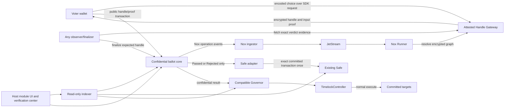

# Technical Architecture: Confidential Governance On Nox

**Status:** Accepted by the user on 2026-07-30; contract implementation plan under review; general
implementation unauthorized.  
**Date:** 2026-07-30  
**Scope:** Production contract and system boundaries for the full accepted product. This document does
not choose visual direction, UI styling, a deployment, or funded infrastructure.

## 1. Architecture Decision

Build a host-neutral confidential ballot core with two governance integrations:

1. a Safe module adapter, which is the primary retrofit and judged execution path; and
2. a compatible OpenZeppelin Governor, which uses normal Governor proposal, queue, timelock, and
   execution semantics but replaces plaintext counting with the confidential core.

The architecture keeps proposal governance normal. Nox changes only the ballot and disclosure path:

`public eligible voter → private support value → encrypted replacement tally → verdict-only reveal →
normal host execution`

A Passed verdict is not a free-form authorization. It is bound to the exact host, proposal, and action
commitment established before voting opened. A Rejected, Withheld, Canceled, or unresolved proposal
cannot execute.

This architecture incorporates the accepted product laws and is the contract plan's technical
authority. The bounded spike proves feasibility of its critical shape; the spike contracts are not
production components.

## 2. Evidence Boundary

### Verified by current released behavior and the local proof

- The released Handle SDK sends encoded plaintext to the attested Handle Gateway and returns an
  encrypted handle/proof for the wallet transaction.
- Nox can keep ballot choices, encrypted intermediates, and exact weighted totals non-public while
  publicly decrypting only a derived boolean verdict.
- The selected weighted For/Against/Abstain graph, deterministic invalid-value normalization,
  replacements, and privacy floor resolve on the real local Nox stack.
- The configured Gateway proof can be checked against the exact stored verdict handle, signer, chain
  domain, type, length, boolean encoding, proposal state, and replay state.
- An official Safe proxy can enable a module through its normal owner threshold and execute the exact
  committed call once.
- A compatible Governor can disable plaintext cast routes, wait honestly for an asynchronous Nox
  result, then use normal Succeeded, queue, timelock, and Executed transitions.
- Runner restart and JetStream negative-acknowledgement redelivery preserve the deterministic result.

### Proposed here and requiring implementation review or proof

- The production contract decomposition and versioning model.
- The eligibility-strategy interfaces for Safe token snapshots and weighted allowlists.
- The exact Safe proposal-author policy and host-native batch encoding.
- The production indexing, timeout presentation, and retry policy.
- Contract-size, gas, dependency-depth, voter-bound, and replacement-rate limits.
- Live testnet behavior and deployment operations.

## 3. Non-Negotiable Architecture Laws

1. **No plaintext ballot route.** Every public voting entry point accepts only the Nox handle/proof
   form. Compatible Governor plaintext cast routes remain disabled.
2. **No individual decryption.** The ballot core never grants a voter, administrator, adapter, indexer,
   or public caller access to a choice or contribution handle.
3. **No total decryption.** For, Against, Abstain, governance quorum weight, and intermediate comparison
   values remain encrypted.
4. **One public disclosure.** At or above the privacy floor, only the proposal's committed boolean
   verdict handle may be publicly decrypted.
5. **No below-floor disclosure.** Below the privacy floor, the terminal result is Withheld, there is no
   public-decryption request, and no governance action is enabled.
6. **One effective ballot.** Each eligible wallet has at most one effective encrypted contribution per
   proposal. A replacement subtracts the prior contribution and adds the new contribution.
7. **Public participation is not a tally.** The public counter is unique eligible wallets with an
   on-chain accepted ballot operation. Abstain counts; replacements do not.
8. **Privacy floor and governance quorum are separate.** The floor decides whether any verdict may be
   disclosed. The host's committed governance rule decides whether the confidential totals pass.
9. **Action binding is immutable.** The verdict is bound to the chain, host, host proposal ID, and
   exact ordered action bundle before voting opens.
10. **Execution is normal and replay-safe.** Safe executes the committed transaction once; Governor
    uses its normal queue/timelock path.
11. **Asynchrony is explicit.** Recording, encrypted computation, proof readiness, finalization, and
    execution cannot be collapsed into one status.
12. **No privileged escape hatch.** An administrator cannot reveal ballots, substitute a verdict,
    bypass the floor, or execute a different action when Nox is delayed.
13. **Permanent ACL means permanent knowledge.** No design depends on later revocation erasing a
    previously granted handle permission.
14. **Trust claims stay exact.** The Handle Gateway sees the encoded input; the current Nox KMS is not a
    threshold-Keyper system; the public-decryption signature does not prove the complete private tally
    history.

## 4. System Topology



The indexer and UI are convenience layers. They do not determine eligibility, count ballots, choose a
verdict, or authorize execution. On-chain state and the configured proof checks remain authoritative.

## 5. Contract Decomposition

### 5.1 `ConfidentialBallotCore`

The core owns the privacy-critical state machine and Nox graph. It is host-neutral.

Responsibilities:

- register a ballot configuration from an authorized host adapter before opening;
- bind the ballot to its host, host proposal ID, action-bundle hash, eligibility strategy, snapshot,
  dates, privacy floor, governance rule, and replacement policy;
- verify eligibility and obtain a fixed public weight;
- validate the Nox input proof and normalize the encrypted choice to For, Against, or Abstain;
- maintain one effective encrypted contribution per eligible wallet;
- count unique on-chain accepted voters without revealing choices;
- freeze voting at the deadline;
- produce Withheld below the privacy floor;
- build and store the exact expected boolean verdict handle at or above the floor;
- validate the configured Gateway evidence for that handle;
- expose only the terminal Passed or Rejected value to the registered host adapter.

The core does not call a Safe target or Timelock itself. Governance execution remains the adapter's
responsibility so ballot secrecy cannot silently acquire host-specific authority.

### 5.2 `IEligibilityStrategy`

Eligibility is immutable per proposal and evaluated at a fixed snapshot. The strategy returns a public
weight; it never receives or exposes the ballot choice.

Required production strategies:

- **`IVotesSnapshotStrategy`** — commits an `IVotes` token and snapshot timepoint, and resolves
  `getPastVotes(voter, snapshot)` when the voter first records a ballot. This is the default compatible
  Governor path and may also serve token-governed Safes.
- **`MerkleWeightedAllowlistStrategy`** — commits an allowlist root whose leaves bind wallet and
  weight. The voter supplies a membership proof on first record. This supports fixed Safe membership
  without proposer-supplied arrays.

The core stores the first resolved weight for the proposal. A replacement reuses that value even if a
live token balance later changes. Zero-weight or invalid membership transactions revert and never
enter the privacy count.

An adapter cannot accept arbitrary fixture arrays as production eligibility evidence. Additional
strategies require a new reviewed version rather than an administrator changing an open proposal.

### 5.3 `SafeConfidentialVotingModule`

The Safe adapter binds a confidential ballot to one existing Safe and one exact Safe transaction.

Responsibilities:

- expose an installation/configuration check for the Safe;
- enforce the selected proposal-author policy before registering a proposal;
- commit the Safe address and exact transaction fields or host-native atomic batch encoding;
- create the linked core ballot before voting opens;
- read only the core's terminal verdict;
- on Passed, call the Safe module execution interface with exactly the committed transaction;
- record execution only if the Safe call succeeds;
- reject altered calls and replays.

Enabling the adapter is a normal Safe owner-threshold transaction. The module is powerful because Safe
modules can execute transactions; therefore the production adapter must be minimal, versioned,
non-upgradeable in place, and incapable of arbitrary calls. Removing the module prevents new
executions, but does not erase old Nox handles or knowledge already granted.

For the full product, a proposal may contain one or more reviewed actions. One action uses a direct
Safe module `Call`. Multiple actions use the official `MultiSendCallOnly` packed format through an
outer `DelegateCall` restricted to an immutable expected-code-hash batch contract. Every inner action
is `Call`; arbitrary inner or outer delegatecall is forbidden. The hash commits every target, value,
calldata item, and order. The Safe itself registers proposals through a normal owner-threshold
transaction.

### 5.4 `ConfidentialGovernor`

This is a new or upgradeable-compatible OpenZeppelin Governor composition, not a retrofit for an
arbitrary immutable Governor.

Responsibilities:

- retain normal Governor proposal creation, voting delay, voting period, proposal threshold, quorum
  policy, action hash, queue, timelock, cancellation, and execution behavior;
- create one linked confidential core ballot using the Governor proposal ID and action hash;
- use the normal Governor voting-power snapshot through `IVotesSnapshotStrategy`;
- disable every public plaintext vote-casting route, including signature, params, and internal paths;
- treat the core result as the counting result without emitting plaintext support values or exact
  tallies;
- prevent success, queue, or execution until an accepted Nox verdict exists.

After the public deadline and before a verdict, the product-specific state is `TallyPending`; the
standard Governor state remains `Pending` for compatibility. Below the privacy floor, detailed state
is `Withheld` and standard state is `Defeated`. After a valid proof, normal Succeeded/Defeated,
Queued, timelock delay, and Executed behavior resumes.

Third-party clients that understand only the standard enum may show Pending after the voting deadline.
The module UI must use the detailed state and explain this compatibility projection.

### 5.5 `DeploymentFactory` And Version Registry

Production instances are versioned rather than silently upgraded:

- a reviewed factory deploys immutable core and Safe-adapter instances;
- compatible Governors are deployed against a named reviewed version;
- a new implementation creates a new version and migration/install decision;
- the verification center exposes addresses, implementation/code hashes, Nox package versions,
  configured Gateway signer/domain, KMS trust statement, and host relationship.

No proxy administrator may change ballot logic, proof rules, action binding, or ACL behavior for an
open proposal.

## 6. Immutable Proposal Commitment

The core's proposal identity must domain-separate the result from every other proposal and chain:

```text
ballotId = hash(
  chainId,
  ballotCore,
  hostAdapter,
  host,
  hostProposalId,
  actionBundleHash,
  configurationHash
)
```

`actionBundleHash` commits the ordered host actions. `configurationHash` commits:

- eligibility strategy and strategy data;
- voting-power snapshot;
- start and deadline;
- public privacy floor;
- host quorum and passage-rule version;
- choice-encoding version;
- replacement policy and any public rate limit;
- Nox/Gateway verification configuration version.

The adapter and core both store or recompute the same binding. Finalization rejects a verdict handle
from another proposal even if that handle decrypts to the same boolean. Execution recomputes the
action commitment, checks Passed, and consumes a proposal-specific replay bit.

## 7. Ballot Recording And Replacement

### Public transaction

The wallet transaction reveals:

- wallet address;
- proposal/ballot ID;
- opaque input handle and proof;
- fixed public voting weight or the data needed to verify it;
- public sequence and whether the operation replaces an earlier one;
- transaction time and gas.

It does not reveal the support value.

### Encrypted update

Inside the core:

1. verify the proposal is open and the wallet is eligible;
2. fix or reuse the snapshot weight;
3. accept the external encrypted integer handle/proof owned by the voter for this core;
4. map `0 → For`, `1 → Against`, and every other representable value to `Abstain`;
5. create encrypted weighted For/Against/Abstain contributions;
6. if replacing, subtract the previous encrypted contributions;
7. add the new encrypted contributions;
8. update the stored encrypted contribution handles and public sequence;
9. on the first accepted record only, increment unique participation.

Every intermediate and stored contribution handle is authorized only to the ballot core as required
for later computation. No voter-specific viewer permission is added.

### Meaning of `Recorded`

`Recorded` means the cast transaction succeeded on-chain and the operation was accepted into the
proposal's deterministic Nox graph. Wallet transactions still awaiting confirmation, reverted
transactions, rejected eligibility proofs, and stale superseded operations do not count.

Once on-chain Recorded, a later Runner or Gateway delay does not silently remove that voter from public
participation. The operation may separately be `Resolving`, `Ready`, or `Delayed` at the infrastructure
layer, and close/finalization may have to wait for its graph. This clarifies the earlier “failed
operations do not count” wording: it refers to operations never accepted on-chain, not to erasing an
accepted ballot because asynchronous infrastructure is temporarily unavailable.

## 8. Close, Privacy Floor, And Verdict

At or after the public deadline, any caller may close the proposal under immutable rules.

### Below floor

If `uniqueRecorded < privacyFloor`:

- core state becomes `Withheld`;
- no verdict handle is exposed for public decryption;
- no exact total is decrypted;
- no host action is authorized;
- the terminal public explanation is “result withheld to protect voter privacy.”

### At or above floor

The core derives, under Nox:

1. encrypted governance quorum satisfaction;
2. encrypted passage-rule satisfaction;
3. one encrypted boolean verdict;
4. the exact expected verdict handle stored for this ballot.

The public participation floor is checked separately before this graph is opened for verdict
decryption. A caller can request or relay proof work, but cannot select a handle.

Finalization accepts only configured-Gateway evidence that matches:

- the stored expected verdict handle;
- the configured chain/domain separator and ballot core;
- the configured signer;
- the expected scalar boolean type and exact length;
- canonical boolean encoding;
- the proposal's `TallyPending` state;
- an unused finalization slot.

Success publishes only Passed or Rejected. No administrator-selected fallback, manual outcome, exact
total, or plaintext recount exists.

## 9. Lifecycle Model

Some states are authoritative on-chain; others are derived UI observations:

| Product state     | Authority               | Meaning                                                     |
| ----------------- | ----------------------- | ----------------------------------------------------------- |
| Scheduled         | Core plus time          | Committed but voting has not opened                         |
| Open              | Core plus time          | Eligible ballots and replacements accepted                  |
| Submitted         | Wallet/client           | Transaction sent but not yet accepted                       |
| Recorded          | Core event/state        | Accepted effective ballot operation                         |
| Resolving/Delayed | Gateway/Nox observation | Accepted encrypted graph is not yet ready                   |
| Closed            | Core plus time          | Voting deadline passed; no new records                      |
| Withheld          | Core                    | Privacy floor not met; no verdict disclosure                |
| Tally pending     | Core                    | Floor met and expected verdict handle fixed                 |
| Proof ready       | Gateway observation     | Candidate evidence can be fetched                           |
| Passed/Rejected   | Core                    | Expected evidence accepted; only verdict public             |
| Queued            | Governor/Timelock       | Passed Governor proposal waiting for normal delay           |
| Executed          | Safe or Governor host   | Exact committed action succeeded                            |
| Execution failed  | Host receipt            | Exact action may be retried; no alternate action is allowed |
| Canceled          | Host/core rule          | Voting/execution stopped; no ballot disclosure              |

The UI must not infer `Proof ready` from elapsed time, and an indexer's opinion cannot advance
authoritative state.

## 10. Normal DAO Execution Paths

### Safe

```text
Safe enables reviewed module
→ normal proposal commits exact Safe transaction
→ confidential ballot reaches Passed
→ anyone calls execute
→ adapter recomputes binding
→ Safe executes exact transaction
→ adapter marks proposal Executed
```

If the Safe call reverts or returns failure, the execution flag does not commit and the exact same
transaction may be retried. A different call or second successful execution is rejected.

### Compatible Governor

```text
normal Governor proposal
→ confidential voting period
→ TallyPending while Nox resolves
→ accepted Passed verdict
→ Succeeded
→ queue through configured TimelockController
→ normal delay
→ execute committed proposal actions
```

The Governor retains its proposal hash and action arrays as the execution authority. The confidential
core cannot bypass the timelock, and a verdict cannot be reused for another proposal.

## 11. Read-Only Indexing And Verification

The indexer reads chain, host, and public Gateway/Nox status to provide:

- proposal and action commitment decoding;
- unique Recorded participation and floor progress;
- the connected wallet's newest public operation and supersession chain;
- asynchronous infrastructure status;
- expected verdict-handle identifier after the floor is satisfied;
- finalization proof provenance and accepted verdict;
- Safe or Governor queue/execution transaction match.

It must not store plaintext choices, receive private handle access, compute a shadow tally, or become a
required signer. The UI can always link back to raw events, contract reads, Gateway signer/domain
configuration, and host receipts.

The verification center explains:

- what is private and permanently undisclosed;
- what is public and linkable to a wallet;
- the Handle Gateway and single-KMS trust boundary;
- what the public-decryption signature validates;
- the exact proposal/action binding;
- the privacy-floor decision;
- why replacement is not receipt-freeness;
- why Shutter threshold Keypers currently distribute key compromise risk better.

## 12. Trust And Guarantee Matrix

| Actor/component     | Can observe or control                                                | Cannot legitimately do                                     |
| ------------------- | --------------------------------------------------------------------- | ---------------------------------------------------------- |
| Wallet/public chain | wallet, weight, timing, handle, sequence, participation               | read a support value or exact tally                        |
| Handle Gateway      | encoded plaintext during input preparation; public-decryption request | honestly be described as never seeing the choice           |
| Current Nox KMS     | full current decryption-key authority within the TEE stack            | honestly be described as threshold custody                 |
| Ballot core         | encrypted handles, public rules, expected verdict binding             | expose individual choices/totals through an approved route |
| Runner/JetStream    | encrypted operation graph and delivery state                          | select a different committed action or valid proof handle  |
| Finalizer           | relay candidate evidence                                              | choose a verdict, signer, domain, handle, or encoding      |
| Safe adapter        | call its bound Safe after Passed                                      | execute an uncommitted call or replay a success            |
| Compatible Governor | normal proposal and execution lifecycle                               | accept a plaintext vote or queue before a valid result     |
| Indexer/UI          | derive and present public state                                       | become the source of tally or execution authority          |

This design protects public-chain ballot confidentiality under the Nox trust model. It does not protect
against a compromised Gateway/KMS observing inputs, endpoint surveillance, coercion of a supervised
final vote, public participation analysis, or inference from the final verdict and external facts.

## 13. Failure And Recovery Rules

| Failure                                                   | Required behavior                                                                         |
| --------------------------------------------------------- | ----------------------------------------------------------------------------------------- |
| Handle preparation fails before signing                   | Show preparation failure; nothing is Recorded; retry from input preparation               |
| Wallet transaction reverts                                | Do not count participation; explain the revert; retry or replace before close             |
| Runner stops or message is negatively acknowledged        | Preserve deterministic handles; redeliver/resume; do not create a new proposal result     |
| Recorded graph remains unresolved                         | Show Delayed; keep the public record; do not silently omit the ballot or reveal plaintext |
| Privacy floor not met                                     | Terminal Withheld; no proof request, verdict, or execution                                |
| Candidate proof has wrong signer/domain/handle/type/value | Reject independently; keep TallyPending; allow a correct proof later                      |
| Finalization repeated                                     | Reject replay                                                                             |
| Safe execution fails                                      | Do not mark Executed; permit retry of only the exact committed transaction                |
| Timelock not ready                                        | Keep normal Queued state until the configured delay expires                               |
| Indexer is unavailable or wrong                           | Fall back to direct contract/host reads; indexer cannot change state                      |
| Module is removed after a vote                            | No new Safe execution through it; prior ACL knowledge is not erased                       |

Timeouts are presentation and alert thresholds, not authority to discard a Recorded ballot, reveal a
fallback tally, or substitute an administrative outcome.

## 14. Verification Strategy Before General Implementation

### Foundry

- unit tests for proposal binding, eligibility, snapshot weight, replacement math, floor, proof checks,
  host authorization, cancellation, and replay;
- fuzz tests for choice normalization, replacement sequences, unequal weights, quorum/passage rules,
  and malformed proof encodings;
- invariants for one effective ballot, monotonic unique participation, no below-floor verdict,
  single finalization, action-hash stability, and execute-once behavior;
- access-control tests proving no individual or total handle becomes publicly readable.

### Real local Nox and host integration

- keep the bounded Hardhat 3 harness because the released local Nox stack currently depends on it;
- exercise the real Handle Gateway, KMS, ingestor, JetStream, Runner, and public-decryption proof;
- test Safe owner-enable, exact call or approved batch, failure/retry, and replay;
- test Governor snapshot weights, every disabled plaintext route, asynchronous state projection,
  below-floor Defeated mapping, queue, timelock, and execution;
- repeat Runner restart, negative-acknowledgement redelivery, and the full proof-negative matrix;
- prove the selected voter/replacement bound at measured worst-case dependency depth.

Mocks may support isolated development but cannot support a privacy, Nox, proof, or host-execution claim.
A live testnet proof remains a separate explicitly authorized gate because it requires deployment,
accounts, funding, and external infrastructure.

## 15. Adopted Contract Decisions

1. Safe proposal registration requires a transaction executed by the bound Safe under its normal
   owner threshold.
2. The judged configuration is four unequal-weight wallets, privacy floor four, and at most two
   replacements after the initial ballot. Version 1 enforces an immutable organization minimum
   privacy floor of at least four while permitting a higher proposal floor. Larger-electorate
   performance is not claimed without a later benchmark.
3. Safe execution uses direct `Call` for one action or official `MultiSendCallOnly` for atomic action
   batches, with no arbitrary delegatecall.
4. A delayed Recorded graph remains tally-pending indefinitely; there is no on-chain timeout or
   administrator-selected result.
5. Contracts are immutable and versioned. Ethereum Sepolia is the planned first live gate, but live
   addresses, deployment, funding, and evidence require separate authorization.

These are configuration and security decisions, not permission to remove accepted product features.

## 16. Next Gate

Review the contract-only implementation plan. UI planning remains paused while the external designer
owns visual direction. Do not begin contract or frontend implementation, testnet deployment, funded
infrastructure, public publishing, or submission claims without the corresponding explicit user
authorization.

## Related Evidence

- [Accepted product decision](../decisions/2026-07-30-product-definition-acceptance.md)
- [Current decision](../decisions/CURRENT.md)
- [Plain-English product definition](../briefs/2026-07-29-plain-english-product-definition.md)
- [Product specification](../specs/2026-07-29-confidential-governance-module.md)
- [Product surface map](2026-07-29-product-surface-map.md)
- [Nox feasibility research](../research/2026-07-29-nox-tee-voting-feasibility.md)
- [MACI architecture lessons](../research/2026-07-29-maci-architecture-lessons.md)
- [Shutter architecture lessons](../research/2026-07-29-shutter-architecture-lessons.md)
- [Governance-host comparison](../research/2026-07-29-governance-host-comparison.md)
- [Bounded local PASS report](../verification/2026-07-30-full-shape-spike-report.md)
- [Source manifest](../sources/source-manifest.md)
